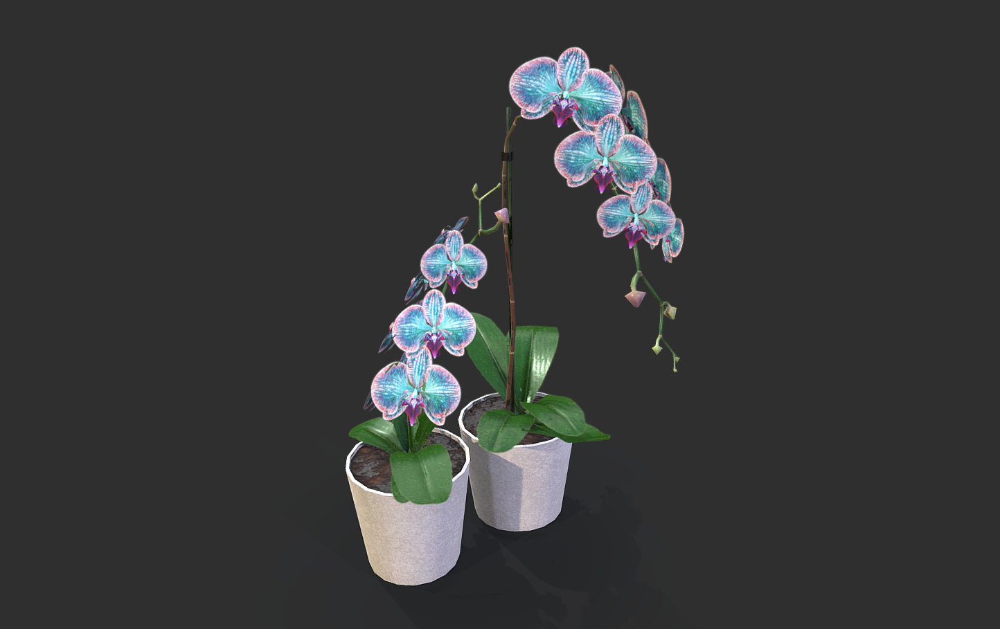

# 🌸 Details Beautiful - Orquídea Animada

Una experiencia web interactiva que presenta un modelo 3D de una orquídea animada con música de fondo inmersiva.

<p align="center">
  
</p>

## 📋 Descripción

Este proyecto ofrece una experiencia visual hermosa y envolvente con un modelo 3D de orquídea integrado desde Sketchfab. Los visitantes pueden activar la experiencia con un botón interactivo y disfrutar de una vista 3D completa con música de acompañamiento.

## 🎨 Características Principales

- **Modelo 3D Interactivo**: Orquídea 3D completamente renderizada desde Sketchfab
- **Pantalla de Inicio**: Botón elegante para iniciar la experiencia
- **Música de Fondo**: Audio inmersivo que acompaña la visualización
- **Diseño Fullscreen**: Experiencia a pantalla completa en todos los dispositivos
- **Interfaz Minimalista**: Enfoque total en el modelo 3D
- **Animación Automática**: El modelo inicia la animación automáticamente

## 📁 Estructura del Proyecto

```
Details_beautifull/
├── index.html              # Página principal con la orquídea
├── Corazon.html            # Página alternativa con modelo de corazón
├── Orchid.glb              # Modelo 3D de orquídea (formato GLB)
├── heart.glb               # Modelo 3D de corazón (formato GLB)
├── musica1.mp3             # Archivo de música de fondo
├── .git/                   # Control de versiones
└── README.md              # Este archivo
```

## 🚀 Cómo Usar

1. **Abrir el Proyecto**
   - Descarga o clona el repositorio
   - Abre `index.html` en tu navegador web preferido

2. **Interactuar**
   - Haz clic en el botón "Iniciar Experiencia"
   - La pantalla de inicio se oculta y aparece el modelo 3D
   - Disfruta de la música de fondo mientras exploras el modelo
   - Usa el mouse para rotar, zoom y explorar el modelo 3D

3. **Páginas Disponibles**
   - `index.html`: Vista de la orquídea
   - `Corazon.html`: Vista alternativa con modelo de corazón

## 🛠️ Tecnologías Utilizadas

- **HTML5**: Estructura base de la página
- **CSS3**: Estilos personalizados y transiciones
- **JavaScript Vanilla**: Lógica de interacción sin dependencias externas
- **Sketchfab API**: Incrustación de modelos 3D
- **WebGL**: Renderización de gráficos 3D en el navegador
- **HTML5 Audio**: Reproducción de música de fondo

## 📱 Requisitos del Navegador

- Navegador moderno con soporte WebGL
- Chrome, Firefox, Safari o Edge (versiones recientes)
- Conexión a internet para cargar modelos desde Sketchfab
- Soporte para reproducción de audio HTML5

## 🎯 Funcionalidades Principales

### Pantalla de Inicio
- Botón elegante con efecto hover
- Color de tema personalizado (tonos magenta y púrpura)
- Transición suave a la vista 3D

### Visualización 3D
- Modelo de orquídea de Sketchfab completamente interactivo
- Controles 3D nativos de Sketchfab
- Autoplay habilitado al iniciar

### Audio
- Música de fondo en loop continuo
- Se inicia automáticamente al activar la experiencia
- Archivo: `musica1.mp3`

## 💄 Personalización

Para modificar la experiencia:

### Cambiar la Música
Reemplaza `musica1.mp3` con tu archivo de audio y actualiza la ruta en `index.html`:
```html
<audio id="background-music" src="./tu-musica.mp3" loop></audio>
```

### Cambiar el Modelo 3D
Actualiza el `src` del iframe de Sketchfab con tu modelo deseado:
```html
<iframe 
  src="https://sketchfab.com/models/TU-ID-MODELO/embed">
</iframe>
```

### Personalizar Estilos
Modifica los colores en el CSS:
- Color de fondo: `#1a0d1a`
- Color de botón: `#ffccff` y `rgba(255, 102, 204, 0.5)`

## 📝 Notas de Desarrollo

- El proyecto no requiere servidor; funciona como archivo estático
- La incrustación de Sketchfab requiere conexión a internet
- Los archivos GLB se incluyen como modelos locales alternativos
- Todo el código JavaScript está inline en el HTML

## 🌐 Modelos Disponibles

1. **Orquídea** (`Orchid.glb`)
   - Modelo 3D completo en formato GLB
   - Visualizado a través de Sketchfab

2. **Corazón** (`heart.glb`)
   - Modelo 3D alternativo
   - Disponible en `Corazon.html`

## ✨ Experiencia del Usuario

1. El usuario ve una pantalla elegante con un botón de inicio
2. Al hacer clic, se activa la música de fondo
3. Aparece el modelo 3D de la orquídea a pantalla completa
4. El usuario puede interactuar libremente con el modelo
5. La música continúa en un loop mientras disfruta de la experiencia

## 🎵 Música

- Archivo: `musica1.mp3`
- Formato: MP3
- Reproduccción: En loop automático

## 👤 Autor

Proyecto creado como parte del portfolio de Kriptom.

---

⭐ Disfruta esta experiencia visual y sensorial única.
